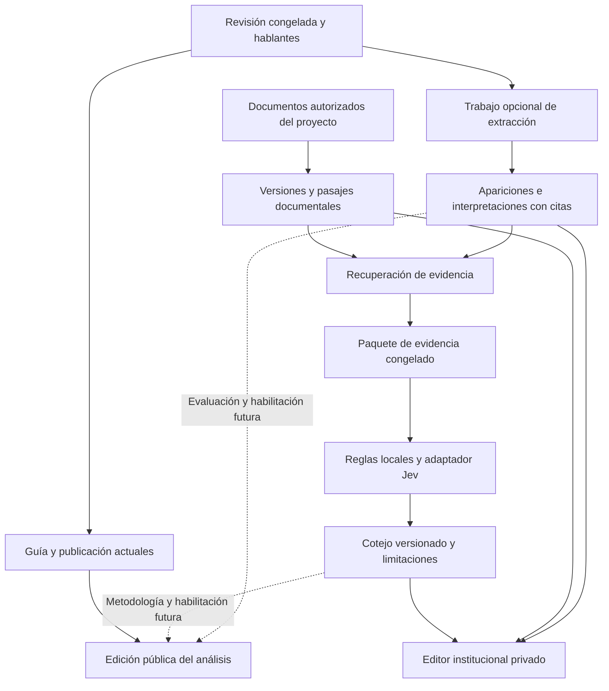

# Integración de afirmaciones y cotejo documental

**Estado:** propuesta para revisión, 22 de septiembre de 2026. Esta PR contiene diseño; no implementa ni activa capacidades. Parte de `develop` en `a0b8cde`.

**Recomendación:** ampliar el dominio institucional de Spring y el processor existente con trabajos opcionales e independientes para extraer afirmaciones, preparar documentos y cotejar evidencia. PostgreSQL conserva el estado y las relaciones; R2 conserva los artefactos; Workflows coordina llamadas acotadas a proveedores. Jev será un adaptador de evaluación, no la fuente de verdad ni una dependencia para publicar la transcripción.

**Decisión confirmada por el usuario:** integrar Luna mediante la API de OpenAI, con credenciales de la aplicación. El acceso de ChatGPT utilizado en el experimento queda como procedencia histórica. Jev se refiere al evaluador de **TypeSafe AI**.

**Revisión del 23 de septiembre:** la [auditoría de las tres vertientes del frontend](frontend-readiness-2026-09-23.md) distingue capacidades conectadas, huecos de interfaz y contratos todavía ausentes. Las ocho capacidades previas tienen consumo en el front; antes del panel de afirmaciones hay que cerrar la coherencia entre transcript revisado, preview y descarga. Afirmaciones/cotejos continúan siendo desarrollo nuevo de ambos lados.

Este anexo desarrolla el [plan canónico](transparency-evidence-search-implementation-plan.md), que conserva sus fases y requisitos de revisión mínima. La solicitud del 22 de septiembre abre la planificación de una integración antes aplazada; no da por aprobada su salida pública. El desarrollo hospedado continúa suspendido desde el 21 de septiembre. No se reactivan contenedores, rutas, Cron, despliegues ni pagos.

## 1. Experiencia que queremos construir

En el editor institucional, una persona abre una sesión ya revisada y encuentra afirmaciones enlazadas al minuto y al hablante disponible. Puede consultar los documentos asociados y, cuando exista un cotejo, ver qué pasajes respaldan, contradicen o no permiten resolver una afirmación. Puede corregir una interpretación o descartarla sin modificar lo que dice la transcripción.

Ejemplo: «o copagamento subiu de 86 a 104,50 euros por tonelada» debe conservar la cita, el periodo, el lugar, la modalidad y ambos importes. Un documento que permite calcular `95 × 1,10 = 104,50` bajo ciertas condiciones respalda esa operación; por sí solo no acredita los 86 euros anteriores ni que Vigo cumpliese las condiciones. La interfaz explica esa limitación con sus fuentes.

La publicación de la sesión sigue funcionando aunque no haya clave de Jev, documentos suficientes o resultados de extracción. El trabajo humano adicional mantiene el objetivo habitual de **2–5 minutos por sesión** y el umbral de fallo de **10 minutos**. No añadimos una segunda cola obligatoria para aprobar cada afirmación. Si una salida opcional no supera los controles, se omite de la superficie pública y permanece diagnosticable en privado.

## 2. Qué existe y qué falta

La [línea base del laboratorio](claims-evidence-lab-baseline-2026-09-22.md) conserva resultados, límites y huellas. La extracción tiene ejecuciones reales; **Jev todavía no tiene ninguna**. Sus 24 fixtures y 16 tests locales verifican preparación y comportamiento simulado, no calidad del modelo.

| Pieza existente | Encaje propuesto | Límite que debemos resolver |
|---|---|---|
| [`ReviewService`](../../src/main/java/gal/subtitula/api/transparency/review/ReviewService.java), revisiones congeladas y segmentos con tiempos | Entrada estable del extractor después de completar revisión | Separar contenido, atribución y configuración del análisis; no extraer contra una revisión mutable |
| [`V11`](../../src/main/resources/db/migration/V11__normalized_evidence_model.sql): jobs, eventos, hashes y versiones | Reutilizar ciclo de vida y observabilidad | Los tipos están cerrados en SQL/Java; los trabajos requieren proyecto; no hay ledger de llamadas con resultado incierto |
| [`enrich-session.ts`](../../processing-worker/src/workflows/enrich-session.ts) | Reutilizar patrón de bloques, artefactos y callbacks firmados | Crear un Workflow independiente; no copiar sus reintentos de generación a llamadas pagadas con resultado incierto |
| [`InternalProcessingService`](../../src/main/java/gal/subtitula/api/transparency/internal/InternalProcessingService.java) | Integrar admisión, despacho y persistencia | `pendingWorkflows` cae por defecto en ingestión; `failJob` llama a `project.fail` sin distinguir trabajos auxiliares |
| [`V14`](../../src/main/resources/db/migration/V14__agenda_and_structured_guide.sql): agenda y guía | Contexto y navegación de la sesión | Un tema de guía no es la identidad de un asunto transversal ni una afirmación |
| [`ProjectDocumentService`](../../src/main/java/gal/subtitula/api/transparency/publication/ProjectDocumentService.java) y [`V15`](../../src/main/resources/db/migration/V15__publication_snapshots.sql) | Punto de entrada del corpus | Hoy se guardan metadatos/URL; falta capturar contenido y versiones. `publication_documents` fija IDs de documentos, no versiones inmutables del contenido |
| [`SearchIndexService`](../../src/main/java/gal/subtitula/api/transparency/search/SearchIndexService.java) | Reutilizar PostgreSQL y evaluación de búsqueda | `DOCUMENT_CHUNK` contiene título, emisor, fecha y URL: no prueba que se indexe el cuerpo del PDF |
| [`PublicationService`](../../src/main/java/gal/subtitula/api/transparency/publication/PublicationService.java) | Mantener snapshots, corrección y retirada | Un resultado tardío no debe cambiar silenciosamente una publicación existente |
| [`TransparencyCapabilities`](../../src/main/java/gal/subtitula/api/transparency/capability/TransparencyCapabilities.java) | Activación gradual y valores predeterminados desactivados | Las ocho capacidades actuales no incluyen extracción, corpus ni cotejo |

Los hablantes actuales pertenecen al proyecto: no existe una identidad de persona consolidada entre sesiones. Hay estructura de organizaciones en la base, pero los servicios actuales autorizan principalmente por propietario del proyecto. Esta integración debe respetar ese control; no puede asumir que la autorización de toda una organización ya funciona.

## 3. Alternativas de arquitectura

| Alternativa | Ventaja | Coste o problema | Propuesta |
|---|---|---|---|
| Añadir extracción y Jev al trabajo `ENRICH` | Menos piezas iniciales | Acopla guía, latencia, errores, reintentos y disponibilidad de proveedores | Descartar para el flujo principal |
| Nuevos trabajos dentro de Spring + processor actuales | Reutiliza permisos, trazabilidad, datos y operación; permite avanzar sin Jev | Exige aislar fallos y versionar contratos explícitamente | **Opción recomendada** |
| Servicio independiente de agentes y una nueva base de conocimiento | Aislamiento de cómputo y libertad de stack | Duplica despliegue, permisos y consistencia antes de demostrar necesidad | Reconsiderar solo ante límites medidos |

Spring decide permisos, idempotencia, admisión por presupuesto, validación de referencias y estado de dominio. El processor hace peticiones a proveedores, transformación acotada y escritura de artefactos. La UI consulta estado; no mantiene viva la tarea ni llama directamente a modelos. Se conserva el gateway `/backend/*` mediante `API_SERVICE`, sin añadir un prefijo `/api` a Spring.

## 4. Modelo de información propuesto

Los nombres siguientes describen tablas/contratos futuros, no migraciones incluidas en esta PR. Las migraciones serán aditivas y conservarán proyectos heredados.

| Entidad | Responsabilidad y referencias inmutables |
|---|---|
| `claim_extraction_runs` | Proyecto, revisión, huella del texto y atribución, job, ventanas, modelo, instrucciones, esquema y artefactos |
| `claim_occurrences` | Aparición en una revisión: segmentos, rangos de cita, tiempos y referencia al hablante; procedencia del run |
| `claim_interpretations` | Versiones de la proposición normalizada de una aparición, incertidumbres, autor de la revisión y relación con su versión anterior |
| `document_versions` | Contenido de un `project_document`, SHA-256, claves R2, emisor, procedencia, fechas, derechos, visibilidad y método de extracción |
| `document_passages` | Fragmento de una versión, texto y localizador: página/sección/rango, cabeceras, unidades y notas de tabla |
| `evidence_bundles` y sus enlaces | Interpretación objetivo, versión de recuperación, alcance consultado, candidatos seleccionados y versiones/pasajes exactos |
| `claim_assessments` y sus enlaces | Paquete, política, proveedor/modelo, resultado semántico, citas, limitaciones y cálculos; referencia al intento y al artefacto original |
| `provider_attempts` | Intención durable de llamada, exclusión mutua, huella de entrada, recibo, respuesta, consumo conocido o incierto y reconciliación |

Cada referencia debe pertenecer al mismo proyecto autorizado, mediante restricciones e invariantes de servicio. Los artefactos son privados por defecto y sus claves las genera el servidor. No basta con comprobar que un UUID existe.

**Aparición, afirmación, asunto y tema son conceptos distintos.** Una proposición puede repetirse en varios minutos; una aparición puede contener componentes distintos; varias afirmaciones pueden tratar un mismo asunto. El primer incremento guarda apariciones e interpretaciones sin resolver identidades globales. La similitud sugiere enlaces, pero no fusiona automáticamente afirmaciones ni personas entre sesiones. La resolución de asuntos será un enriquecimiento posterior y opcional: una clave de asunto ausente no debe hacer perder una extracción válida.

La interpretación conserva, cuando el pasaje los permite, sujeto, propiedad, valor, unidad, moneda, base de IVA, ámbito geográfico, periodo referido, condiciones, modalidad y fase administrativa. La fecha de la sesión se guarda separada del periodo de la afirmación. «Propuesto», «aprobado», «adjudicado» y «pagado» no son intercambiables. Las citas de terceros conservan atribución y modalidad; un nombre mencionado no identifica al hablante.

Una cita válida significa que se encuentra en la revisión indicada. No certifica que la interpretación sea fiel ni que el hecho sea verdadero. Los campos no sustentados quedan sin resolver; una corrección crea una interpretación nueva, sin reescribir la cita ni borrar el resultado anterior.

## 5. Contratos y ejecución

### 5.1 Extracción

Al completar la revisión, el flujo actual sigue creando `ENRICH`. Más adelante, con capacidad y presupuesto disponibles, podrá crear además `EXTRACT_CLAIMS` en la misma transacción. En el primer incremento solo habrá activación explícita por proyecto y replay sin proveedor.

El contexto incluye revisión congelada, idioma, metadatos de sesión, hablantes y ventanas deterministas de segmentos con vecinos. Cada ventana tiene un ámbito propietario: el contexto vecino ayuda a interpretar, pero no genera apariciones duplicadas fuera de ese ámbito. Cualquier ampliación de contexto se limita a la misma revisión y tiene un máximo de llamadas/tokens.

Para importar el ensayo, un manifiesto debe mapear sus IDs locales de segmento a los UUID de la revisión de destino y comprobar hashes, texto y rangos. No asociar una respuesta antigua a cualquier sesión con título parecido. Si cambió la transcripción o no se puede demostrar la correspondencia, el replay queda como fixture de prueba y no como resultado válido de ese proyecto.

El adaptador devuelve candidatos y necesidades de contexto mediante un esquema versionado. La validación comprueba segmentos, tiempos, cita literal con rangos verificables, atribución, límites y formato. Se guardan también rechazos con motivo. Las incertidumbres semánticas se conservan explícitamente; no se completan con conocimiento del modelo.

La extracción usará **Luna xhigh mediante la API de OpenAI**, por instrucción del usuario. Se propone Responses API con `model: gpt-5.6-luna`, `reasoning.effort: xhigh` y salida estructurada conforme a un esquema versionado. La [ficha oficial de Luna](https://developers.openai.com/api/docs/models/gpt-5.6-luna) documenta esas capacidades; su disponibilidad y cuotas en la cuenta concreta se comprobarán al implementar. El ensayo utilizó Codex y una suscripción interactiva: hay que repetir la evaluación sobre el adaptador API, sin asumir resultados idénticos.

El processor llama a OpenAI con una clave de servicio del proyecto API de Subtitula, propuesta como secreto `OPENAI_API_KEY`, aislada por entorno y nunca expuesta al navegador. El consumo se contabiliza como API de la aplicación; no se reutiliza la sesión, suscripción ni credenciales de ChatGPT. Esta PR no crea ni instala claves. El [contrato de autenticación](https://developers.openai.com/api/reference/overview) exige proteger la credencial en el servidor.

El adaptador conserva ID de petición/respuesta, modelo reportado, uso y artefacto original; trata rechazo del modelo, salida incompleta y fallo de esquema como estados explícitos, no como cero afirmaciones. [Structured Outputs](https://developers.openai.com/api/docs/guides/structured-outputs) ayuda a validar el formato, pero no reemplaza las comprobaciones de citas y fidelidad. Duración, cancelación, retención y recuperación tras interrupción se verifican con el contrato API antes del piloto. El replay permanece sin red y no hay fallback al CLI, a la cuenta de ChatGPT ni a otro modelo.

### 5.2 Corpus documental

Primer alcance: corpus seleccionado por el operador y asociado al proyecto. Reutilizar `project_documents` como identidad y añadir contenido versionado. Se empieza importando un manifiesto revisado con pasajes y hashes, para cerrar el recorrido sin construir un rastreador web ni depender de OCR.

Después, la ingesta automática debe almacenar el original, extraer texto y producir localizadores reproducibles. Un PDF escaneado queda como «requiere OCR» si esa capacidad no está disponible. El parser/OCR se elige tras medir tamaño, páginas, consumo y límites del Worker; nunca mediante una tarea larga en una petición de Spring ni suponiendo que el Worker ejecuta cualquier binario.

Para futuras descargas, la validación actual de URL HTTPS no basta: aplicar límites de bytes/páginas/tiempo, formatos permitidos, validación de cada redirección, rechazo de redes privadas/metadatos y protección frente a cambios de resolución DNS. Los documentos son datos no confiables; sus instrucciones nunca autorizan herramientas ni llamadas adicionales. Una URL oficial no implica permiso para redistribuir todo su contenido.

No mezclar el corpus privado con la proyección pública `search_documents`. Se crean consultas e índices internos sobre pasajes documentales en el mismo PostgreSQL. El proyecto define el ámbito inicial; compartir corpus entre proyectos u organizaciones exige un contrato posterior de permisos y procedencia.

### 5.3 Recuperación y paquete de evidencia

La recuperación empieza con filtros de entidad, periodo, lugar, magnitud, fase y condiciones, más búsqueda léxica. Se evalúa pgvector después si mejora recall sin degradar abstención. Recuperar contexto de tablas, notas y excepciones; conservar fuentes favorables y adversas. Varias copias de una noticia comparten cadena de procedencia y no cuentan como corroboraciones independientes.

El paquete congela interpretación, versión del corpus, consultas/filtros, candidatos y recortes seleccionados, así como los descartes relevantes y límites de cobertura. Conserva los textos exactos enviados. Cambiar el corpus o el método de recuperación genera un paquete distinto. Una búsqueda completada sin evidencia admisible puede producir abstención local; un error del buscador deja el cotejo pendiente, no produce `insufficient`.

La versión inicial del corpus puede ser un manifiesto inmutable de IDs y hashes de versiones documentales, guardado en R2 y referenciado en PostgreSQL. Un timestamp de búsqueda sin ese inventario no permite reconstruir qué documentos se consultaron.

Esta etapa es una novedad: los documentos del laboratorio se seleccionaron manualmente. Mediremos por separado recuperación, evaluación sobre un paquete correcto y resultado extremo a extremo. La ausencia de un resultado en un corpus acotado nunca significa que no exista evidencia en el mundo.

### 5.4 Evaluación documental

Contrato propuesto: `AssessmentRequest` referencia una interpretación y un paquete inmutables; `AssessmentResult` conserva resultado original, resultado aplicado por política, referencias a pasajes, cálculos/limitaciones y metadatos del modelo. Jev recibe solo ese contexto, sin la referencia de evaluación ni permisos de navegación. Los IDs de pasajes deben aparecer explícitamente en el contenido/instrucciones, no solo como claves externas del JSON.

| Resultado semántico | Significado limitado al paquete |
|---|---|
| `supported` | La evidencia sustantiva cubre la proposición completa con su alcance y condiciones |
| `contradicted` | Evidencia comparable entra en conflicto directo con la proposición |
| `insufficient` | Falta evidencia, solo repite el anuncio, cubre parte o no coincide el ámbito |
| `conflicting` | Fuentes sustantivas comparables sostienen posiciones incompatibles que el paquete no resuelve |
| `not_verifiable` | Opinión, valoración o promesa sin una proposición factual suficientemente definida |

Estas etiquetas no califican la honestidad de una persona. Una promesa concreta puede contener hechos verificables, por ejemplo que se aprobó una dotación; no se excluye automáticamente por hablar del futuro.

Normalizar fechas, unidades e IVA y calcular aritmética con código decimal, conservando operandos y citas. Descomponer afirmaciones compuestas sin modificar la aparición original. `supported` exige cobertura de todos sus componentes y condiciones; apoyar una parte no basta. Una contradicción debe señalar el componente comparable; fuentes incompatibles no se resuelven mediante mayoría de copias. Mientras no exista composición fiable de varias fuentes, estos casos se abstienen con la limitación visible.

El adaptador verifica versión esperada, integridad del JSON, etiquetas, probabilidades y referencias existentes. Guardar la respuesta original antes de normalizarla. La confianza devuelta no es una probabilidad calibrada de verdad; el 0,85 del laboratorio es provisional. La política conserva los desacuerdos y puede abstenerse, pero no convierte una salida errónea en un supuesto acierto del modelo.

Jev está diseñado para evaluación estructurada; la explicación inicial se construye con plantillas, limitaciones y citas comprobables. No depende de pedirle un ensayo ni de añadir otro generador de texto.

### 5.5 Trabajos, idempotencia y consumo

Proponer tipos explícitos `EXTRACT_CLAIMS`, `INGEST_CORPUS` y `ASSESS_CLAIM`. Actualizar juntos la restricción SQL, enum Java, contratos TypeScript, selección de pendientes, despacho de Workflows y rutas internas HMAC. Rechazar un tipo desconocido; nunca enviarlo al Workflow de ingestión por defecto.

Separar **estado operativo del job** de **resultado semántico del cotejo**. Se reutilizan `QUEUED`, `RUNNING`, `WAITING`, estados de fallo, éxito y cancelación existentes. `WAITING` lleva un motivo como `provider_unavailable`, `budget_exhausted` o `provider_outcome_unknown`; al reanudar pasa por `RUNNING`. Sin respuesta válida, el resultado semántico es nulo. Un job exitoso puede terminar legítimamente con `insufficient`.

La primera implementación debe corregir el límite de `failJob`: fallar un trabajo auxiliar solo cambia su estado y sus eventos. No llama a `project.fail`, no revierte una sesión `READY` y no bloquea la publicación. Los callbacks validan la versión del job y de sus entradas congeladas; no dependen de que toda la entidad proyecto permanezca sin cambios mientras corre otro trabajo.

La transacción de Spring guarda el job como intención durable. El arranque del Workflow es idempotente por job; la reconciliación recupera arranques perdidos cuando el entorno esté habilitado. No se crea un Cron nuevo ni se reactiva el existente para este diseño. En local se ejercita el despachador de forma explícita; con hospedaje suspendido no se admiten trabajos remotos que queden esperando indefinidamente.

La clave de operación incluye proyecto/revisión, hashes de texto y atribución, ámbito de ventana, modelo/instrucciones/esquema y parámetros de extracción; para cotejo, interpretación, paquete, normalizador y política de evaluación. Una restricción única y una adquisición transaccional impiden dos envíos simultáneos. Si caduca una concesión después de marcar envío, no se supone que el proveedor dejó de trabajar.

Antes del HTTP se reserva presupuesto y se persiste el intento. Si se pierde la respuesta o el proceso termina después del envío, el resultado/consumo quedan **inciertos** y se bloquea el reenvío automático. Una idempotency key local no garantiza exactamente una ejecución en un proveedor externo. Se reconcilia por recibo cuando exista esa API; si no, una repetición requiere una decisión explícita que conserva el intento anterior y su posible gasto.

Las llamadas pagadas no heredan reintentos automáticos del SDK ni de `step.do`. Los errores ciertos previos al envío pueden reprogramarse; los errores HTTP se registran y solo se reintentan bajo una política que conozca su efecto y presupuesto. Guardar una respuesta válida en R2 y confirmar su persistencia puede reintentarse sin volver a inferir. Probar la caída entre cada uno de esos límites.

Registrar por operación proveedor/modelo, intentos, duración, bytes/tokens reportados, tarifa versionada y estimación. Uso desconocido es `null`, nunca cero. El presupuesto limita llamadas, contexto, bytes/páginas, concurrencia y gasto reservado por proyecto/organización; las reservas inciertas no se liberan como ahorro demostrado. La estimación total suma extracción, ingesta, recuperación y cotejos nuevos, evitando contar la reutilización como otra inferencia. Esta PR no fija tarifas ni autoriza consumo.

## 6. Correcciones, publicaciones y búsqueda

**Corrección de transcripción o hablante.** Nueva revisión y nuevos hashes; los resultados previos conservan su procedencia y se muestran como pertenecientes a esa revisión. Solo se reutiliza una salida si coinciden todas sus entradas. Una optimización posterior puede recalcular ventanas afectadas y contexto vecino; no se presume que editar un segmento solo afecta a ese segmento.

**Corrección de una interpretación o documento.** Nueva versión, sin sobrescribir la anterior. Los cotejos dependientes quedan obsoletos para la vista actual y se pueden recalcular con otra clave. Un documento conserva fecha de publicación, recuperación y vigencia cuando se conozcan; no convierte el estado actual de una web en evidencia de lo que existía años antes.

**Salida pública futura.** Primeras fases completamente privadas. Para resultados posteriores a la publicación se propone una edición inmutable de análisis, vinculada a una `publication` y a su revisión exacta. Fija interpretaciones, cotejos y versiones documentales elegibles. Una nueva edición requiere una liberación explícita y trazable; no añade una aprobación manual por afirmación. El snapshot de vídeo/transcripción permanece intacto. Se implementará solo si supera el gate público, incluyendo DTOs permitidos, corrección y un enlace visible a la edición consultada.

Una referencia a un documento no puede publicar un pasaje privado indirectamente. Retirada de la publicación o del permiso de una fuente debe filtrar inmediatamente todos los endpoints y resultados afectados, además de invalidar caches/proyecciones. No confiar solo en la reindexación eventual. No emitir nuevos enlaces firmados a artefactos retirados; los ya emitidos tienen una ventana de validez que se debe acotar y documentar. Los registros históricos internos se conservan según la política de retención y borrado del producto.

**Búsqueda ciudadana.** Mantener la recuperación directa por pasajes y añadir, si demuestra mejora, una proyección derivada de afirmaciones elegibles. El ensayo omitió una propuesta de vivienda relevante: buscar solo afirmaciones perdería esa respuesta. Comparar pasajes solos, afirmaciones solas y ambos; mostrar siempre atribución, cita, minuto y alcance documental. Las afirmaciones parciales pueden servir como pistas de recuperación, pero no como hechos estructurados certificados.

Una consulta exhaustiva («todas las propuestas sobre vivienda») requiere paginación y cobertura explícita; un top-k no prueba exhaustividad. No sumar importes de propuestas, presupuestos aprobados y pagos ni mezclar periodos. La búsqueda en lenguaje natural y la identidad de personas/asuntos entre sesiones siguen necesitando evaluación propia. No se introduce chat generativo en esta integración inicial.

## 7. API y editor: superficie propuesta

La [auditoría del frontend](frontend-readiness-2026-09-23.md) fija los recorridos de creador, operario y ciudadanía, con prioridades F0/F1. Reutilizar componentes visuales no obliga a guardar el transcript institucional mediante el estado heredado `Project.words` del creador.

Rutas orientativas, pendientes del contrato del primer incremento:

| Operación | Contrato propuesto |
|---|---|
| Iniciar extracción | `POST /projects/{projectId}/claim-extractions`, revisión y clave idempotente; `202` con job |
| Consultar afirmaciones | `GET /projects/{projectId}/claims`, filtro de revisión/run y cursor estable |
| Corregir interpretación | `POST /projects/{projectId}/claims/{occurrenceId}/interpretations`, versión esperada y motivo |
| Importar corpus | `POST /projects/{projectId}/documents/{documentId}/versions`, manifiesto autorizado; los archivos grandes usan el patrón de intención de subida/R2 |
| Solicitar cotejo | `POST /projects/{projectId}/claims/{occurrenceId}/assessments`, interpretación y versión de corpus; `202` con job |
| Consultar cotejos | `GET /projects/{projectId}/claims/{occurrenceId}/assessments`, historial y estado operativo |

Los endpoints reutilizan sesión, CSRF, permisos de proyecto y límites existentes. El cliente no decide organización, claves de almacenamiento, URLs del proveedor ni versión de política ejecutable. Los callbacks internos conservan autenticación HMAC y validación estricta de pertenencia y versiones. No se exponen rutas públicas nuevas en el primer incremento.

El `/processing` actual devuelve un solo `job`. Antes de ejecutar guía, extracción y cotejo en paralelo, acordar una consulta de estado por análisis/job con IDs, revisión, etapa y motivo de espera. La UI debe distinguir «sesión lista» de «cotejo pendiente» y no deducir que terminar el último job significa que todas las etapas han finalizado.

En `subtitula-gal`, ampliar `components/editor/institution-workspace.tsx` y las superficies existentes de enriquecimiento/publicación. Una sección «Afirmacións» permite abrir el minuto, consultar la interpretación y desplegar sus fuentes. «Documentos» muestra ingesta y versiones. Gallego predeterminado y castellano como alternativa; no cambiar el contrato de idiomas por las fixtures multilingües.

Mostrar «Sen cotexar», «Agardando polo servizo», «Evidencia insuficiente» y «Resultado dunha versión anterior» como situaciones distintas; revisar las etiquetas finales con el vocabulario del producto. No mostrar porcentajes de veracidad ni un ranking de políticos. Los problemas puntuales pueden corregirse o excluirse; cerrar el navegador no cancela el job y fallar el cotejo no deshabilita Publicar.

Capacidades propuestas, todas desactivadas por defecto: extracción de afirmaciones, corpus documental, cotejo privado, búsqueda pública de afirmaciones y cotejo público. La respuesta de capacidades diferencia habilitación de disponibilidad del proveedor sin revelar secretos. Una clave ausente mantiene operativo el replay local y bloquea solo la llamada dependiente. No se ofrecen controles que prometan un servicio suspendido.

## 8. Secuencia de PRs y condiciones de avance

Esta RFC no abre una segunda fase canónica en progreso ni gradúa el piloto actual. La siguiente fila es un incremento propuesto, no trabajo autorizado de implementación dentro de esta PR.

| Incremento | Resultado revisable | Dependencia / condición de salida |
|---|---|---|
| D0 — esta PR | Arquitectura, inventario, evidencia y decisiones propuestas | Revisión del diseño; ninguna llamada a proveedores |
| F0 — preparación del frontend existente | Transcript institucional coherente con preview, lectura/edición puntual, descarga y captions públicos | Ver bloques F0-A/F0-B de la auditoría. F0-A precede al panel integrado de I1; contratos/replay backend pueden prepararse sin esperar a Jev |
| I1 — recorrido privado con replay | Contratos versionados, migración mínima de runs/apariciones/interpretaciones, aislamiento de jobs y panel con citas para una revisión congelada | Fixtures portables sin secretos, pruebas de permisos/versiones/idempotencia y publicación sin extracción. **No necesita Jev** |
| I2 — extractor real acotado | Adaptador OpenAI Responses para Luna xhigh, ventanas y ledger de intentos/consumo | Clave API y presupuesto disponibles; regresiones del laboratorio, contrato API y muestra independiente. Sin autenticación de ChatGPT |
| I3 — corpus y recuperación | Versiones/pasajes, importación revisada, consultas internas y paquetes congelados | Permisos/procedencia, tablas/fechas, recall de evidencia y abstención evaluados. Puede prepararse sin I2 ni Jev usando replay |
| I4 — Jev privado en observación | Adaptador con respuestas guardadas y después llamadas reales; diagnósticos sin salida pública | Acceso disponible; smoke y protocolo completo; errores/consumo incierto conservados; sin fallback silencioso |
| I5 — piloto privado | Recorrido completo sobre sesiones y documentos nuevos | Calidad, coste/latencia, carga y tiempo humano medidos; revisión independiente y gobernanza del corpus |
| I6 — publicación y búsqueda derivadas | Ediciones públicas, corrección/retirada y comparación de recuperación | Gates separados para publicar extracción y publicar cotejos; metodología, responsabilidad editorial y evaluación pública aprobadas |

I1 no obliga a introducir todas las tablas propuestas. I3 añade las del corpus; I4 añade las del cotejo. Los paquetes se definen antes de llamar a Jev. La inferencia de I2/I4 espera a disponer de credenciales y presupuesto autorizado; este plan permite avanzar en contratos, replay, UI y corpus sin ellos.

El primer incremento del nuevo dominio sigue siendo **una afirmación importada mediante replay, asociada a una revisión congelada, visible solo para su propietario y enlazada al minuto correcto**. Su prueba de aceptación incluye repetir la importación sin duplicados, rechazar referencias ajenas y comprobar que publicar la transcripción sigue funcionando si el job auxiliar falla. Esa PR incorporará el contrato API antes de su PR dependiente de frontend. En el frontend se recomienda comenzar por F0-A para que el panel consuma una representación correcta del transcript y no replique sus problemas actuales.

## 9. Evaluación y pruebas de aceptación

| Área | Comprobaciones necesarias antes de activar |
|---|---|
| Extracción | Cita literal, hablante desconocido, fecha de sesión frente a ejercicio, discurso referido, propiedad/valor, componentes y contexto vecino; asunto ausente no elimina candidato válido |
| Corpus | Mismo URL con nueva versión; contenido privado; procedencia común; PDF sin texto; cabeceras/unidades/notas; fecha y fase documental |
| Recuperación | Pasaje pertinente ausente del top-k, fuentes de ambos signos, evidencia de otro municipio/periodo, consultas sin respuesta; errores de recuperación separados de ausencia |
| Cotejo | Los 24 casos conservando R03 fuera de scoring, resultados originales y política separados; aritmética condicional de Sogama y alta confianza equivocada |
| Operación | Doble despacho concurrente, caída antes/después del envío y tras guardar respuesta, timeout sin reenvío, fallo de persistencia sin reinferencia, callback obsoleto y cancelación |
| Seguridad | Referencias de otro propietario, artefactos privados en búsquedas públicas, inyección documental, permisos revocados, SSRF en futura descarga y DTOs sin datos internos |
| Compatibilidad | Flags apagados, proyectos heredados, guía/publicación sin resultados auxiliares, retirada y corrección; misma imagen y configuración por entorno |
| Experiencia | Tiempo activo de revisión, navegación al minuto, teclado/accesibilidad, límites y estados comprensibles; ausencia de revisión exhaustiva obligatoria |

Los controles conocidos deben pasar antes de un piloto, pero no bastan para aprobar calidad. Preparar antes de inferir una muestra nueva gallega/castellana, con varios municipios, sesiones, fases administrativas y tipos de fuente, anotada por personas independientes. Separar por sesión/fuente entrenamiento de reglas y evaluación; no contar paráfrasis de una misma afirmación como casos independientes.

Medir recuperación de afirmaciones de referencia y precisión sobre una muestra de todas las salidas, fidelidad por campo, duplicados, recall documental, falsos respaldos/contradicciones, abstención, cobertura, variación entre repeticiones, coste y p95. Congelar tamaño de muestra y umbrales de aceptación con el responsable del piloto antes de ver sus resultados. Son gates pendientes: ni 24 fixtures ni confianza 0,85 los sustituyen. Hasta entonces las etiquetas no se publican como un producto validado.

Por cada PR de implementación, ejecutar los tests de contrato y dominio pertinentes, el suite API con PostgreSQL/Testcontainers, tests/typechecks del processor y, si cambia el editor, tests/build del frontend. Añadir casos de comportamiento y frontera; no snapshots que solo repitan el código.

## 10. Decisiones propuestas para discutir

1. **Corpus inicial por proyecto y seleccionado por operador.** Reduce ambigüedad y permite medir recuperación antes de buscar en toda la web. La ampliación a un corpus institucional compartido vendría con permisos explícitos.
2. **Dos productos derivados independientes:** afirmaciones fieles al discurso y cotejo con documentos. La segunda capacidad puede llegar más tarde y tener requisitos públicos más estrictos.
3. **Jev sustituible y Luna xhigh por API de OpenAI.** El transporte API ya está confirmado por el usuario; queda por revalidar calidad y operación. Conservar datos/contratos propios permite comparar proveedores sin migrar el dominio.
4. **Asuntos transversales y chat después de demostrar búsqueda útil.** No convertir la resolución de un catálogo global en requisito para guardar una cita válida.
5. **Ediciones explícitas de análisis para la salida pública.** Facilitan resultados tardíos y correcciones sin cambiar silenciosamente el contenido que alguien consultó.

Quedan abiertos el tamaño/umbrales de la muestra independiente, el parser/OCR, el presupuesto operativo, los parámetros operativos del adaptador API y la responsabilidad de publicación del cotejo. El acceso a Luna será por API de OpenAI; eso no queda abierto. Ninguno de los detalles pendientes impide diseñar e implementar I1 con replay; los que afecten a inferencia o publicación deberán resolverse antes de habilitar esas etapas.

## 11. Referencias técnicas

- [Luna en la API de OpenAI](https://developers.openai.com/api/docs/models/gpt-5.6-luna), [autenticación](https://developers.openai.com/api/reference/overview) y [salida estructurada](https://developers.openai.com/api/docs/guides/structured-outputs): base del adaptador API confirmado por el usuario.
- [Contrato oficial de TypeSafe](https://docs.typesafe.ai/api): entrada `state`/`questions`, resultados estructurados y consumo; revisar sus reintentos al implementar el adaptador.
- [Limitaciones documentadas de Jev 1.13](https://docs.typesafe.ai/model-jaggedness/jev-1.13): precisión numérica, fechas, contexto y contenido adversarial. Motivan reglas locales y evaluación independiente.
- [Reintentos de Cloudflare Workflows](https://developers.cloudflare.com/workflows/build/sleeping-and-retrying/): configurar cada etapa según el efecto de repetirla. La durabilidad del Workflow no garantiza unicidad de una llamada externa.

Documentación consultada el 22 de septiembre de 2026. La compatibilidad exacta de modelos, SDK y límites se vuelve a comprobar en la PR de implementación, sin actualizar versiones silenciosamente durante un run.
