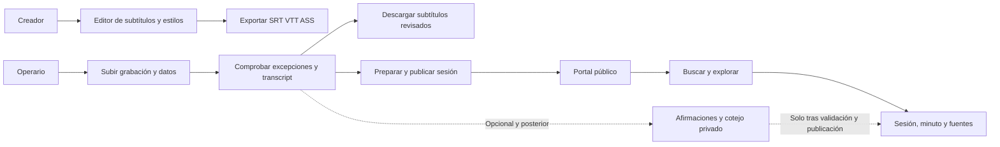

# Estado del frontend y siguiente integración

**Auditoría del 23 de septiembre de 2026**, dentro de la [PR de diseño #2](https://github.com/s-counago/subtitula-gal-api/pull/2). Complementa la [arquitectura de afirmaciones y cotejo](claims-evidence-integration-plan.md). No implementa cambios de interfaz ni habilita servicios.

## 1. Diagnóstico

**El frontend ya consume las ocho capacidades institucionales existentes. El retraso principal está en completar y ordenar la experiencia, no en construir ocho pantallas desde cero.** Hay diferencias importantes entre las tres vertientes:

| Vertiente | Base real | Distancia al producto descrito | Prioridad |
|---|---|---|---|
| Creador | Subida, transcripción, edición, estilos/animación, tiempos, autoguardado y exportación SRT/VTT/ASS | Baja para el editor y exportación de subtítulos. No equivale a exportar un vídeo MP4 con subtítulos incrustados; el medio se conserva localmente en este flujo | Mantener y proteger de regresiones |
| Operario institucional | Subida durable, revisión por excepciones, voces, agenda, guía, publicación/corrección y métricas | Media, con huecos críticos en sincronización, descarga, consulta continua del transcript y estados. El camino moderno no conserva todas las salidas del antiguo | Primera entrega funcional |
| Transparencia pública | Archivo, buscador léxico/híbrido, sesión con vídeo, transcript, temas, intervenciones, acuerdos, documentos y enlaces al minuto | Media para consultar lo ya existente; alta para preguntas ciudadanas, corpus completo y cotejos. Faltan subtítulos en el reproductor público y aprovechar datos ya disponibles | Segunda entrega, coordinada con la salida institucional |
| Afirmaciones, corpus versionado y Jev | Ensayos aislados y RFC | Desarrollo nuevo de backend **y** frontend; no son endpoints existentes pendientes de conectar | Después de cerrar la base, con contratos y activación gradual |

No asignamos porcentajes de finalización: que exista un componente, que tenga tests y que resuelva una tarea institucional son medidas diferentes. Las ocho capacidades tienen puntos de consumo; eso no significa que ocho recorridos completos estén terminados o validados con usuarios.

### Alcance y evidencia

- Frontend inspeccionado: `subtitula-gal`, commit `8bee2b3bef1bdb66922504f9731b6fbbaaaa8bb7`, igual a `origin/develop` tras actualizar referencias.
- Backend inspeccionado: `subtitula-gal-api`, commit `a0b8cded8ec68cdba55f17684222c56678a22a0c`, igual a `origin/develop`. La PR añade documentación sobre esa base.
- Se leyeron componentes, clientes API, controladores, DTOs, entidades y tests. Los cambios locales previos de ambos repositorios se preservaron. Las notas locales de septiembre ayudan a interpretar el historial, pero no sustituyen el código.
- Comprobación funcional local de una conversión de transcript, suite frontend y build. No se realizó en esta auditoría un recorrido de navegador con una sesión real, una prueba con operarios ni una nueva inferencia.
- Desarrollo hospedado permanece suspendido desde el 21 de septiembre. Los ensayos remotos del 10 de septiembre son evidencia histórica; no se confunden con disponibilidad actual.
- El alcance comprobado es **grabaciones subidas y transcripción posterior**. Emisión y subtitulado en directo no aparecen como flujo implementado en ninguno de los dos repositorios; requerirían un alcance adicional si «transmisión» se refiere a directo.

## 2. Cobertura del backend que sí existe

| Capacidad actual | Backend | Frontend conectado | Valoración |
|---|---|---|---|
| Subida institucional durable | Borrador, intención de subida, R2, verificación, Workflow y webhook | `upload-flow`, `processing-upload`, recuperación del medio en `editor-route` | Integrado; falta cerrar recuperación de estados/errores en la experiencia completa |
| Transcript normalizado | Revisiones, segmentos, tiempos y hablantes | `getTranscript`, `InstitutionalReviewTab`, hidratación inicial del editor | Integrado parcialmente con el motor de subtítulos; ver F01 |
| Revisión por excepciones | Cola, edición de texto/voces, resolución, actividad, congelación | `InstitutionalReviewTab` | Integrada; acceso a segmentos sin aviso y consulta después de cerrar necesitan trabajo |
| Agenda automática | Agenda pegada, alineaciones y confirmación | `AgendaEditor`, `InstitutionalEnrichmentPanel` | Integrada; hay capacidades de corrección más ricas que el botón «Comeza aquí» |
| Guía estructurada | Temas, contribuciones, acuerdos candidatos y evidencia | Panel de enriquecimiento y página pública | Integrada; la UI muestra un subconjunto y todavía necesita jerarquía por tarea |
| Publicación | Checklist, snapshots, corrección, retirada, documentos | `PublicationPanel`, `PublicSessionView` | Integrada; falta enlazar versiones históricas en UI y completar las salidas de subtítulos |
| Búsqueda léxica | Filtros, paginación, resultados y citas | Archivo y búsqueda de sesión | Integrada; faltan controles/paginación en algunos contextos |
| Búsqueda híbrida | Processor, embeddings y ranking con fallback del servidor | Cliente `/processing`, mismo explorador | Integrada; preguntas por intención/persona y relevancia general siguen pendientes |

El descubrimiento de capacidades está conectado y falla con valores desactivados. Conviene distinguir en la interfaz «capacidad no habilitada» de «no pudimos leer el estado», sin convertir un error de conexión en una invitación silenciosa al recorrido antiguo.

Referencias de entrada: [capabilities del front][fe-capabilities], [revisión][fe-review], [enriquecimiento][fe-enrich], [publicación][fe-publication], [clientes de búsqueda][fe-search-api], [controlador de publicación](../../src/main/java/gal/subtitula/api/transparency/publication/PublicationController.java) y [controlador de búsqueda](../../src/main/java/gal/subtitula/api/transparency/search/PublicSearchController.java).

## 3. Huecos concretos y quién debe resolverlos

P0 significa necesario para un recorrido fiable del producto descrito. P1 completa la operación y la consulta pública. P2 corresponde a capacidades nuevas o ampliaciones. Los hallazgos son de código salvo la reproducción explícita de F01; no se presentan como incidencias reproducidas todas en navegador.

### F01 · P0 · El texto revisado y los subtítulos no comparten una proyección fiable

`InstitutionalReviewTab` actualiza sus propios segmentos mediante la API. El reproductor y su overlay reciben `session.state.cues` de otro estado, inicializado por `useEditorSession`. No hay una actualización del padre al guardar una revisión. `EditorRoute` solo intenta hidratar el transcript al cargar y cuando `project.words` está vacío; tampoco vuelve a hacerlo cuando termina la transcripción con la pantalla ya abierta.

Además, `transcriptWords()` prefiere `wordTimings` a `segment.text`. En el backend, `EvidenceSegment.review()` modifica `reviewedText`, pero conserva los tiempos y textos originales por palabra. Ambos se devuelven en el DTO. Se ejecutó la función real del frontend, sin red, con esta entrada representativa:

| Texto revisado | Texto en tiempos originales | Texto proyectado por el código actual |
|---|---|---|
| `San Paulo` | `San Pedro` | **`San Pedro`** |

**Cambio propuesto:** el transcript normalizado y su revisión son la fuente institucional. Crear una proyección explícita de subtítulos revisados y actualizarla al recibir/editar/congelar el transcript; el autoguardado heredado de `Project.words` no debe sobrescribirla. Si cambia el número de palabras, no inventar alineación exacta: una primera política puede conservar tiempos del segmento y marcar la granularidad. Preview, descarga y publicación deben referirse a la misma revisión/proyección.

**Responsabilidad:** frontend y contrato compartido con backend. Se puede empezar con el texto/tiempos de segmento existentes; un artefacto durable de cues/VTT versionado necesitará soporte de backend. **Aceptación:** corregir un nombre actualiza transcript y preview, persiste tras recarga y aparece igual en el archivo exportado; abrir antes de que termine ASR no deja el reproductor desactualizado.

Evidencia: [EditorRoute][fe-route], [estado del editor][fe-session-state], [conversión de transcript][fe-review-api], [entidad EvidenceSegment](../../src/main/java/gal/subtitula/api/transparency/transcript/EvidenceSegment.java), [TranscriptQueryService](../../src/main/java/gal/subtitula/api/transparency/transcript/TranscriptQueryService.java).

### F02 · P0 · Falta descarga en el recorrido institucional moderno

`exceptionReviewEnabled` selecciona `ExceptionInstitutionWorkspace`. `ExportMenu` y la descarga del certificado solo se renderizan dentro de `LegacyInstitutionWorkspace`. Terminar la revisión moderna conduce a enriquecimiento/publicación y no ofrece la misma salida de subtítulos. Que el exportador común exista no significa que el operario pueda alcanzarlo.

**Cambio propuesto:** una zona estable «Descargar» después de la revisión, también sin publicar. Ofrecer VTT y SRT con un perfil institucional fijo y transcript legible; los estilos y animaciones del creador permanecen en su vertiente. Versionar la política de segmentación/legibilidad y basarla en F01. El informe de revisión, si se conserva, debe describir lo revisado y su versión: no trasladar sin revisión las promesas del antiguo «certificado» al nuevo flujo por excepciones.

**Responsabilidad:** principalmente frontend para descarga local; backend para artefactos públicos durables y trazabilidad si se adopta esa salida. **Aceptación:** con capacidades modernas activas, revisar → descargar funciona sin Jev, guía o publicación, y el texto coincide con la revisión seleccionada.

Evidencia: [las dos ramas institucionales][fe-institution], [exportador compartido][fe-export], [certificado heredado][fe-certificate].

### F03 · P0 · La revisión sencilla necesita acceso permanente al transcript y errores accionables

La transcripción completa está en un desplegable antes de finalizar. Sus filas permiten saltar al tiempo, pero no corregir un segmento que no tenga un aviso activo. Al completar o reabrir una revisión congelada, el componente retorna antes de ese desplegable y muestra enriquecimiento. El backend ya permite editar segmentos de una revisión de trabajo sin depender de un aviso concreto.

Durante la carga, cualquier excepción provoca otro intento a los cinco segundos y el mensaje «Preparando a revisión». Eso mezcla espera legítima de ASR con una sesión caducada, falta de permiso o fallo de red. El acceso al editor también conserva «Cargando…» si falla la carga principal.

**Cambio propuesto:** transcript siempre consultable, edición puntual opcional de cualquier segmento de trabajo y lectura de la revisión congelada después del cierre. Conservar avisos como entrada principal y una sola acción de avance; no volver a exigir confirmar cada frase. Separar pendiente, error recuperable, autenticación, permiso y entorno suspendido; reintentos acotados y botón claro.

**Responsabilidad:** frontend sobre contratos existentes. Aclarar además el contrato de quitar una asignación de voz: hoy el select puede enviar `speakerId: null`, pero `ReviewService.reviewSegment()` interpreta null como conservar la voz, no desasignarla. **Aceptación:** corregir voluntariamente un segmento sin aviso; consultar todo el texto tras cerrar; un 401/403 no termina en espera indefinida.

Evidencia: [revisión][fe-review], [carga del editor][fe-route], [ReviewService](../../src/main/java/gal/subtitula/api/transparency/review/ReviewService.java).

### F04 · P0 para salida pública · El vídeo público todavía no tiene pista de subtítulos

`PublicSessionView` renderiza un `<video>` sin `<track>` ni overlay de subtítulos. El transcript aparece debajo, pero no sustituye la posibilidad de activar subtítulos en la reproducción. El DTO público proporciona texto de segmentos y tiempos, pero no una URL de captions/versionado de cues.

**Cambio propuesto:** pista VTT derivada de la revisión publicada, compartiendo la política de F01/F02. Un primer incremento puede generarla desde los segmentos públicos; para sesiones largas y entrega estable, definir un artefacto versionado y su URL. Mantener activación de captions, selección del fragmento en reproducción y enlaces que funcionen al abrir el vídeo en frío.

**Responsabilidad:** frontend para el reproductor y primera proyección; contrato/artefacto backend para la solución durable. **Aceptación:** la versión pública elegida reproduce captions con el texto publicado, soporta saltos y no expone una revisión privada o más reciente.

Evidencia: [reproductor público][fe-public-session], [DTO público](../../src/main/java/gal/subtitula/api/transparency/publication/dto/PublicSessionResponse.java).

### F05 · P1 · El panel de sesiones no representa el ciclo de vida actual

`SessionDashboard` usa `approvedAt` para dividir entre «Aprobada» y «Falta comprobala», y muestra `createdAt` como fecha. El backend y `ProjectSummary` ya exponen `status`, pero la tabla lo ignora. Una sesión revisada, todavía enriqueciendo, publicada o retirada no comunica su siguiente acción con precisión.

**Cambio propuesto:** tabla por estado y tarea pendiente, con acciones «Continuar revisión», «Ver publicación», «Resolver incidencia» y descarga cuando corresponda. Reutilizar la traducción de estados de `ProjectLifecycleStatus`. Separar fecha de sesión de fecha de subida.

**Responsabilidad:** frontend para estados. Backend/DTO para añadir fecha de sesión al resumen y para consultar varias etapas concurrentes sin una petición por fila. El contrato actual `/processing` devuelve un único `job`; no servirá por sí solo para guía, extracción y cotejo simultáneos.

Evidencia: [dashboard][fe-dashboard], [estado detallado][fe-lifecycle], [ProjectSummary](../../src/main/java/gal/subtitula/api/project/dto/ProjectSummary.java), [ProcessingStatusResponse](../../src/main/java/gal/subtitula/api/transparency/processing/dto/ProcessingStatusResponse.java).

### F06 · P1 · Metadatos y documentos: hay más formulario que contrato cerrado

La subida permite título, fecha, órgano, lugar y tipo, y promete poder revisarlos antes de publicar. El PATCH actual solo admite nombre y campos del editor, no fecha/órgano/lugar/tipo. Esa edición requiere backend además de pantalla.

Para documentos, el API ya admite tipo, emisor, fecha y permiso de publicación. El front solo solicita título/URL y envía `type: other` y `publicationPermission: true`. Tampoco hay endpoints de edición/borrado documental en el controlador actual. Un gestor documental completo o la revocación de una fuente no se resuelven solo añadiendo botones.

**Cambio propuesto:** formulario compacto de datos de sesión con guardado real; documentos con metadatos y permiso explícito, separados de la selección para publicar. Enlazar el futuro estado de ingesta/pasajes sin presentarlo como existente. `SessionDetails` es un componente heredado con estado local y una promesa de guardar personas para otras sesiones; no usarlo como base del nuevo directorio.

**Responsabilidad:** mixta. **Aceptación:** recargar conserva cambios autorizados; un documento sin permiso no se preselecciona para publicar; no se promete persistencia de un campo local.

Evidencia: [subida][fe-upload], [formulario documental][fe-publication], [SessionDetails heredado][fe-session-details], [PATCH actual](../../src/main/java/gal/subtitula/api/project/dto/ProjectUpdateRequest.java), [documentos](../../src/main/java/gal/subtitula/api/transparency/publication/ProjectDocumentService.java).

### F07 · P1 · La página pública puede aprovechar mejor los datos ya disponibles

El DTO y los tipos del front contienen cargo del hablante, moción/resultado de un acuerdo, tipo/emisor/fecha documental y varias apariciones de un punto del orden del día. La vista muestra sobre todo etiquetas y resúmenes; para agenda usa solo `occurrences[0]`.

**Cambio propuesto:** jerarquizar «Qué se trató», «Qué se acordó», «Quién intervino» y «Fuentes», siempre con acceso a la grabación/transcript. Mostrar datos documentales y todas las apariciones relevantes; distinguir una intervención de una persona mencionada. No exigir al ciudadano comprender los tipos internos del índice. En móvil, mantener accesibles vídeo, transcript y regreso a resultados sin una página de paneles técnicos.

**Responsabilidad:** frontend para presentar estos campos. Un directorio compartido de personas, acuerdos agregados entre sesiones o asuntos estables necesita contratos de backend nuevos. **Aceptación:** una persona llega desde el resultado a la fuente que explica el acuerdo, con cargo/fecha/procedencia cuando existan y sin inventarlos cuando falten.

Evidencia: [página pública][fe-public-session], [contrato consumido][fe-publication-api].

### F08 · P1 · Filtros, paginación y versiones no están aprovechados de extremo a extremo

- El buscador global pagina y permite órgano/fecha/idioma/tipo cuando hay consulta. Sin texto llama a `getPublicArchive()` sin filtros, aunque el formulario sigue mostrando filtros activos. El endpoint de archivo tampoco acepta filtros/paginación.
- La búsqueda dentro de una sesión utiliza los valores por defecto, renderiza la primera página y no ofrece siguientes resultados ni filtros por hablante/punto, aunque el contrato los soporta.
- `getPublicSession(slug, version)` y el backend admiten versión, pero la vista llama solo con `slug`. El enlace compartido no fija por sí mismo la publicación que se estaba consultando. La búsqueda de sesión tampoco admite versión en su contrato actual.

**Cambio propuesto:** filtros sin consulta que realmente acoten el archivo; paginación de sesión y filtros basados en sus hablantes/agenda; enlaces de evidencia con versión explícita. Para una versión histórica, no mezclar búsqueda de la publicación activa: desactivarla con explicación inicialmente o añadir búsqueda versionada. Diferenciar publicación retirada/inexistente de un error temporal del servicio.

**Responsabilidad:** frontend donde el contrato existe; backend para archivo paginado/filtrado y búsqueda histórica. **Aceptación:** el resultado 21 es alcanzable; un filtro de fecha sin texto funciona; una corrección no cambia la fuente que abre un enlace fijado a una versión accesible.

Evidencia: [explorador][fe-explorer], [página de sesión][fe-public-session], [clientes de publicación][fe-publication-api], [clientes de búsqueda][fe-search-api], [archivo del backend](../../src/main/java/gal/subtitula/api/transparency/publication/PublicSessionQueryService.java).

### F09 · P1/P2 · Preguntas ciudadanas y publicación asistida requieren mejoras compartidas

El explorador ya invita a preguntar en lenguaje natural. El backend devuelve documentos de búsqueda y un total de documentos, no personas, afirmaciones ni intervenciones únicas. No hay un contrato específico de intención «quién/cuándo/qué se acordó». La nota local del 10 de septiembre registró un falso negativo con «quién habló de las pérdidas de las tuberías del agua?» aunque una consulta temática más corta sí recuperaba la evidencia. No se volvió a llamar al entorno hospedado para este informe.

**Cambio propuesto:** adaptar el lenguaje de la pantalla a la cobertura real, agrupar referencias duplicadas sin perder citas y evaluar preguntas completas en gallego/castellano. Una tarjeta de respuesta por persona o asunto depende de recuperación, atribución e identidad, no solo de diseño. Mantener pasajes directos aunque se añada la proyección de afirmaciones. No contar copias de un mismo fragmento como múltiples participantes ni presentar top-k como «todo lo que se dijo».

Antes de ampliar audiencia, preparar también metadatos por sesión y descubrimiento de publicaciones: hoy el título SEO de la sesión es genérico, los datos se cargan en cliente y el sitemap no enumera sesiones. Hay controles de accesibilidad reutilizables en el editor institucional, pero el portal actual no incorpora esa misma barra; realizar pruebas de teclado, foco, lector y móvil. Estas observaciones no equivalen a una auditoría normativa completa.

Evidencia: [explorador][fe-explorer], [página pública][fe-public-session], [ruta pública][fe-public-route], [sitemap][fe-sitemap], [ranking actual](../../src/main/java/gal/subtitula/api/transparency/search/PublicSearchService.java).

## 4. Arquitectura de interfaz recomendada

Conservar un producto y componentes comunes, con tres experiencias claras. Compartir reproducción, referencias a evidencia, formato temporal, proyección de subtítulos y estados de petición. Separar el estado editable libre del creador del transcript institucional versionado: compartir componentes no obliga a guardar ambos mediante `Project.words`.

### Creador

Mantener su flujo de edición/estilo/animación/exportación. No añadir controles de corpus o Jev. El almacenamiento de vídeo del creador usa IndexedDB y puede pedir reanexar el archivo en otro dispositivo; extender R2 al creador o renderizar MP4 serían iniciativas nuevas, no condiciones necesarias para mostrar afirmaciones institucionales.

### Operario

Inicio con estado y siguiente acción. Dentro de sesión, reproductor y acceso al transcript permanecen disponibles. El área principal muestra solo el paso relevante: comprobar, preparar salida o publicar. Agenda, fuentes y análisis son detalles secundarios, con las incidencias que requieren decisión visibles; métricas y mantenimiento quedan bajo herramientas de administración.

Un perfil fijo define subtítulos institucionales; el operario revisa contenido y nombres, no decide tipografías ni ajusta veinte parámetros. Descargar y publicar son resultados independientes. Las afirmaciones futuras se consultan por excepción y nunca convierten el cierre de transcripción en una segunda revisión exhaustiva.

### Ciudadanía

Entrada por una necesidad: localizar un tema, una sesión, una intervención o un acuerdo. Resultado con contexto suficiente para decidir si abrirlo; dentro, minuto verificable, transcript, documento y versión. Usar datos existentes para mejorar la navegación antes de prometer respuestas nuevas.

En la futura tarjeta de afirmación se separan cita, interpretación y relación con documentos. «Aún no cotejada», «evidencia insuficiente» y «servicio no disponible» son situaciones diferentes. El ciudadano solo ve una edición pública elegible; no recibe jobs, costes internos, confidencias sin calibrar ni documentos privados de la pipeline.

## 5. Orden de trabajo y tamaño relativo

Pequeño/medio/grande expresa extensión y dependencias, no una estimación cerrada de días. Los bloques pueden repartirse en PRs acotadas y verificables.

| Bloque propuesto | Contenido | Tamaño | Dependencia / entrega |
|---|---|---|---|
| F0-A · coherencia institucional | F01 y F03: fuente del texto, refresco, edición voluntaria y transcript persistente, errores claros | Medio; contrato compartido | Antes de montar el panel de afirmaciones sobre ese transcript |
| F0-B · salidas y reproducción | F02 y F04: perfil fijo, SRT/VTT, descarga separada, captions públicos de la misma revisión | Medio; artefacto durable amplía backend | Primer recorrido completo «revisar → descargar/publicar → ver subtítulos» |
| F1-A · operación cotidiana | F05/F06: estados, metadatos, documentos y permisos | Medio; parte frontend y parte API | Evita sesiones difíciles de encontrar/corregir y formularios que prometen guardado inexistente |
| F1-B · portal ciudadano actual | F07/F08 y accesibilidad: jerarquía, fuentes, filtros, páginas y versiones | Medio; archivo/búsqueda histórica requieren API | Mejorar lo que ya devuelve el backend sin esperar a Jev |
| I1/I2 de la RFC · afirmaciones privadas | Contrato y replay; después extractor Luna por API | Grande en conjunto; dividir backend y front | F0-A para integrar correctamente el panel; Jev no es requisito |
| I3/I4 · corpus y cotejo privado | Ingesta/versiones/pasajes, recuperación, adaptador Jev y estados de análisis | Grande, desarrollo nuevo | API, credenciales/presupuesto de inferencia y evaluación; preparar fixtures/UI sin ellos |
| I5/I6 · piloto y salida pública derivada | Calidad, tiempo humano, permisos, ediciones y búsqueda útil por tarea | Grande y condicionado al piloto | Gates independientes para afirmaciones y cotejo; no activarlos por tener una pantalla |

**La siguiente PR de frontend recomendada es F0-A**, con una prueba que siga una corrección hasta la previsualización y la recarga. F0-B cierra la viabilidad del subtitulado institucional. El backend de I1 con replay puede diseñarse mientras tanto, pero su panel no debe depender del estado heredado del editor.

Esta secuencia matiza el orden de la RFC: el primer nuevo dominio sigue siendo I1; la preparación de frontend F0 evita apoyarlo sobre una representación desactualizada del transcript. No cambia el alcance de esta PR, que sigue siendo documental, ni abre otra fase canónica en progreso.

## 6. Contratos que faltan frente a mejoras solo de frontend

| Se puede empezar con contratos actuales | Requiere acordar/ampliar backend |
|---|---|
| Estados del dashboard usando `status` | Fecha de sesión en listados y PATCH de metadatos institucionales |
| Transcript completo siempre visible y edición puntual en revisión de trabajo | Semántica explícita para desasignar una voz; proyección durable/versionada de cues si se adopta |
| Mostrar cargo, datos documentales, moción/resultado y repeticiones de agenda | Edición/retirada documental e ingesta del contenido, OCR, versiones y pasajes |
| Paginación y filtros en búsqueda de sesión activa | Archivo global filtrado/paginado y búsqueda de versiones históricas |
| Pasar la versión existente al consultar una sesión | Estados por análisis/job concurrente; el único `job` actual no basta |
| Descarga y pista VTT local desde una revisión con política explícita | URL de captions durable, análisis publicables, extracción/cotejo y agrupación entre sesiones |

Antes de conectar I1/I3/I4, fijar DTOs, estados por etapa, capacidades y fixtures de error/ausencia. Una UI con datos simulados demuestra interacción, no integración. Luna se mantiene por API de OpenAI; Jev, de TypeSafe AI. Ninguno se llama desde el navegador ni usa autenticación de ChatGPT.

## 7. Validación y cierre de viabilidad

Ejecutado el 23 de septiembre, sin reactivar hospedaje:

- `npm test`: **309 tests correctos en 50 archivos**. Hubo un aviso de navegación no implementada de jsdom; el proceso terminó correctamente.
- `npm run build`: **correcto**.
- `./mvnw.cmd -B test`, en el worktree API: **85 tests correctos**, con PostgreSQL/pgvector local en Testcontainers.
- Probe de la función real `transcriptWords`: reprodujo la discrepancia de F01, sin red ni mutaciones.
- La revisión previa de la PR, `e78021a`, tiene CI GitHub correcto. El nuevo commit tendrá su propia ejecución; no se le atribuye el resultado anterior.

Los tests del editor institucional en `workspace.test.tsx` ejercitan por defecto el recorrido heredado con capacidades desactivadas. Hay pruebas de polling/enriquecimiento/indexación, pero no se encontró un test dedicado del recorrido completo de revisión normalizada → preview → descarga ni de `PublicSessionView`. Por eso los 309 tests no descartan los huecos anteriores. Los 16 tests Jev registrados el día anterior siguen siendo tests de laboratorio con respuestas simuladas, no cobertura de UI.

Pruebas de aceptación a añadir en las PRs de implementación:

1. Creador: editar, guardar, reabrir y exportar sin regresión por las nuevas capacidades institucionales.
2. Operario: abrir mientras ASR termina; corregir nombre y hablante; editar un segmento sin aviso; comprobar que preview, transcript, SRT y VTT coinciden; recargar sin perder cambios.
3. Completar revisión sin comprobar todas las frases, descargar sin publicar y publicar sin esperar a análisis opcionales. Medir 2–5 minutos adicionales habituales; más de 10 exige rediseño/mejora.
4. Ciudadanía: abrir sin sesión, activar captions, buscar el resultado 21, filtrar sin texto y llegar al minuto correcto desde un enlace compartido.
5. Versiones: publicar corrección, abrir enlace antiguo elegible y no mezclar transcript/captions/búsqueda; retirar y comprobar fronteras de publicación.
6. Fallos: 401/403/404/servicio suspendido, medio caducado, revisión concurrente y fallo de proveedor; mantener fuentes guardadas y permitir recuperar el recorrido.
7. Usuario real: operario con baja familiaridad y ciudadano en móvil/teclado, sobre una grabación larga representativa. Los tests unitarios no sustituyen esas tareas.

**Criterio práctico:** primero hacer fiable el recorrido existente de subtitulado institucional y consulta pública; después incorporar el nuevo análisis de afirmaciones con sus contratos. El creador puede mantenerse estable durante ambos trabajos.

[fe-capabilities]: https://github.com/s-counago/subtitula-gal/blob/8bee2b3bef1bdb66922504f9731b6fbbaaaa8bb7/lib/api/capabilities.ts
[fe-review]: https://github.com/s-counago/subtitula-gal/blob/8bee2b3bef1bdb66922504f9731b6fbbaaaa8bb7/components/editor/institutional-review-tab.tsx
[fe-enrich]: https://github.com/s-counago/subtitula-gal/blob/8bee2b3bef1bdb66922504f9731b6fbbaaaa8bb7/components/editor/institutional-enrichment-panel.tsx
[fe-publication]: https://github.com/s-counago/subtitula-gal/blob/8bee2b3bef1bdb66922504f9731b6fbbaaaa8bb7/components/editor/publication-panel.tsx
[fe-search-api]: https://github.com/s-counago/subtitula-gal/blob/8bee2b3bef1bdb66922504f9731b6fbbaaaa8bb7/lib/api/search.ts
[fe-route]: https://github.com/s-counago/subtitula-gal/blob/8bee2b3bef1bdb66922504f9731b6fbbaaaa8bb7/components/editor/editor-route.tsx
[fe-session-state]: https://github.com/s-counago/subtitula-gal/blob/8bee2b3bef1bdb66922504f9731b6fbbaaaa8bb7/lib/editor/use-editor-session.ts
[fe-review-api]: https://github.com/s-counago/subtitula-gal/blob/8bee2b3bef1bdb66922504f9731b6fbbaaaa8bb7/lib/api/review.ts
[fe-institution]: https://github.com/s-counago/subtitula-gal/blob/8bee2b3bef1bdb66922504f9731b6fbbaaaa8bb7/components/editor/institution-workspace.tsx
[fe-export]: https://github.com/s-counago/subtitula-gal/blob/8bee2b3bef1bdb66922504f9731b6fbbaaaa8bb7/components/app/export-menu.tsx
[fe-certificate]: https://github.com/s-counago/subtitula-gal/blob/8bee2b3bef1bdb66922504f9731b6fbbaaaa8bb7/lib/compliance/certificate.ts
[fe-public-session]: https://github.com/s-counago/subtitula-gal/blob/8bee2b3bef1bdb66922504f9731b6fbbaaaa8bb7/components/transparency/public-session.tsx
[fe-dashboard]: https://github.com/s-counago/subtitula-gal/blob/8bee2b3bef1bdb66922504f9731b6fbbaaaa8bb7/components/app/session-dashboard.tsx
[fe-lifecycle]: https://github.com/s-counago/subtitula-gal/blob/8bee2b3bef1bdb66922504f9731b6fbbaaaa8bb7/components/editor/project-lifecycle-status.tsx
[fe-upload]: https://github.com/s-counago/subtitula-gal/blob/8bee2b3bef1bdb66922504f9731b6fbbaaaa8bb7/components/app/upload-flow.tsx
[fe-session-details]: https://github.com/s-counago/subtitula-gal/blob/8bee2b3bef1bdb66922504f9731b6fbbaaaa8bb7/components/editor/session-details.tsx
[fe-publication-api]: https://github.com/s-counago/subtitula-gal/blob/8bee2b3bef1bdb66922504f9731b6fbbaaaa8bb7/lib/api/publication.ts
[fe-explorer]: https://github.com/s-counago/subtitula-gal/blob/8bee2b3bef1bdb66922504f9731b6fbbaaaa8bb7/components/transparency/transparency-explorer.tsx
[fe-public-route]: https://github.com/s-counago/subtitula-gal/blob/8bee2b3bef1bdb66922504f9731b6fbbaaaa8bb7/app/(marketing)/transparencia/%5Bslug%5D/page.tsx
[fe-sitemap]: https://github.com/s-counago/subtitula-gal/blob/8bee2b3bef1bdb66922504f9731b6fbbaaaa8bb7/app/sitemap.ts
